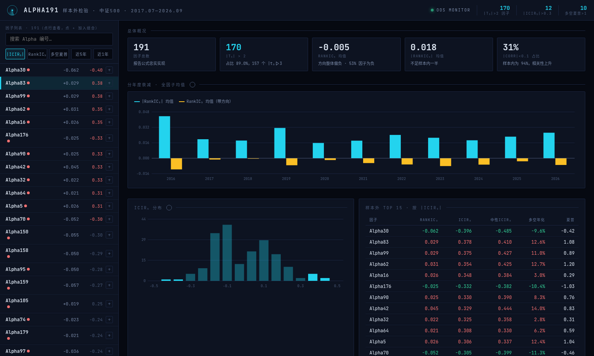
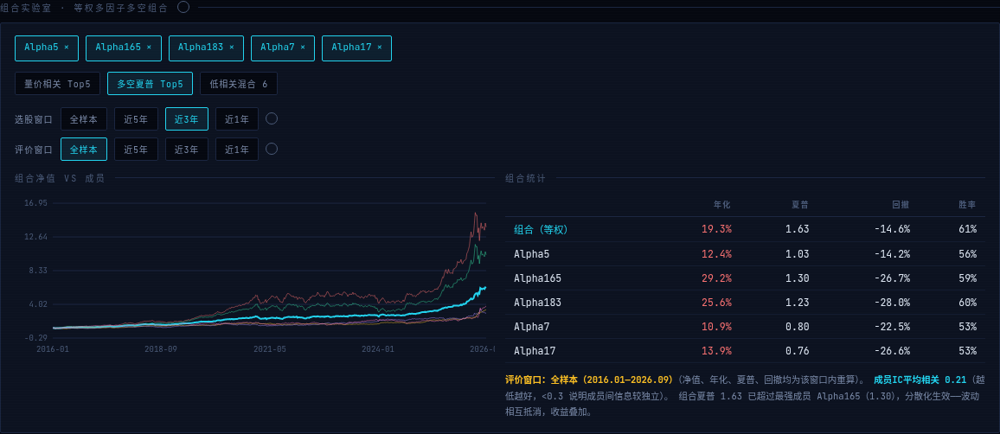

# Alpha191 因子样本外检验与可视化看板

复现国泰君安《数量化专题之九十三》（2017-06-15）的 **191 个价量 Alpha 因子**，并在**中证500 成分股（PIT 区间表）**上完成 **2017.07 – 2026.09 样本外检验**。仓库包含：交互式 HTML 看板、因子计算代码、研究报告与复现交接文档。



## 仓库结构

```
├── dashboard/    # 交互式看板（纯静态 HTML，双击即用，无需部署）
│   ├── index.html      # 看板主文件
│   ├── data.js         # 191 因子全量检验结果数据
│   ├── img/            # 报告插图
│   └── 启动看板.bat     # Windows 一键启动（直开模式，不依赖 Python）
├── code/         # 因子计算流水线（Python）
│   ├── alphas_001_050.py … alphas_151_191.py   # 191 个因子公式实现
│   ├── engine.py / operators.py                # 计算引擎与算子库
│   ├── evaluate.py / run_pipeline.py           # 检验与主流程
│   └── formulas.json / factor_notes.json       # 公式与因子说明
└── docs/         # 文档
    ├── Alpha191研究报告_样本外检验.md   # 完整研究报告（含组合检验、陷阱清单）
    └── 项目讨论文档.md                  # 复现交接文档（验收基准与核对数字）
```

## 快速开始

**看板**：打开 `dashboard/index.html` 即可（Windows 用户双击 `启动看板.bat`）。无需服务器、无需联网。

**因子计算**：见 `code/README_代码包.md`。数据需自备（日线行情 + 中证500 成分区间表）。

## 看板功能

- **因子总览**：191 因子按 ICIR / 多空夏普 / 近5年 / 近1年排序，行业中性化对照，年度 IC 热力
- **因子详情**：RankIC 衰减曲线（h=1/2/3/5/10）、滚动 1 年 ICIR 边际趋势、近 3 月趋势灯、十分位多空净值
- **组合实验室**：等权多因子多空组合，三个一键预设（量价相关 Top5 / 多空夏普 Top5 / 低相关混合 6），反向因子自动翻转，成员平均相关实时显示
- **双窗口设计**：选股窗口（按哪段表现挑成员）与评价窗口（在哪个区间考核成绩）独立并列，预设高亮 + 窗口切换自动重选，点击顺序不影响结果
- **数据自检**：每次打开自动校验序列长度、排行榜单调性、年度有效性、缺口因子清单，异常即红色警示



## 核心结论（详见研究报告）

- 191 因子中 170 个 |t|>2，12 个 |ICIR|>0.3；多空夏普 Top5 等权组合（105/165/183/171/62）全样本年化 21.6%、夏普 1.97，超过最强成员（低相关分散化生效）
- 有效前提：**各自有效 × 互相低相关 × 方向对齐**；同家族高相关组合反而拖累
- 部分早期明星因子存在"吃老本"（分段夏普逐年衰减），需用滚动 ICIR 监控边际变化

## 免责声明

本仓库为研究复现证据，不构成投资建议。因子结果数据由本地行情库（Baostock/新浪/腾讯多源）计算得出，成分股为中证500 PIT 月度区间表。

## License

MIT
